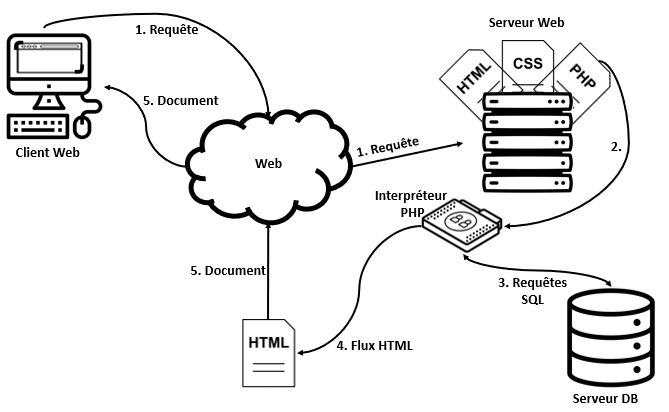

# Introduction
`PHP: Hypertext Preprocessor`, plus connu sous son sigle `PHP`, est un langage de programmation libre, principalement utilisé pour produire des pages Web dynamiques via un serveur HTTP. PHP est un langage impératif orienté objet.

Il est considéré comme une des bases de la création de sites web dits dynamiques mais également des applications web.
PHP a permis de créer un grand nombre de sites web célèbres, comme Facebook, Wikipédia, etc

Le logo considéré comme officiel du PHP est l'`éléPHPant` avec l'acronyme PHP sur son côté. Il est créé en 1998 par Vincent Pontier.


## Bref historique
Le langage PHP fut créé en 1994 par Rasmus Lerdorf pour son site web. C’était à l’origine une bibliothèque logicielle écrite d’abord en langage Perl, puis en langage C. Il s’en servait pour conserver une trace des visiteurs qui venaient consulter son CV. PHP signifiait alors Personal Home Page tools. Le code source de PHP fut publié par son auteur en 1996. En 1997, deux étudiants, Andi Gutmans et Zeev Suraski, redéveloppèrent le cœur de PHP puis son moteur interne, aboutissant à ce qu’on appelle le `Zend Engine`.

Depuis les versions du langage se sont succédées, apportant leur lot d’améliorations et corrigeant les (nombreuses) failles de sécurité apparues en chemin. La version 5 de PHP, sortie en 2004, utilise `Zend Engine 2` et introduit un véritable modèle objet, une gestion des erreurs fondée sur le modèle des exceptions, ainsi que des fonctionnalités de gestion pour les entreprises.

## Fonctionnement du PHP
Même s’il peut être utilisé en ligne de commande, PHP est principalement associé à un serveur Web utilisant le protocole HTTP dans le cadre d’une architecture client/serveur.

Un serveur Web en architecture trois tiers est composé d'un système d'exploitation, un serveur HTTP, un langage serveur et enfin un système de gestion de base de données (SGBD), cela constituant une plate-forme.

Dans le cas de PHP comme langage serveur, les combinaisons les plus courantes sont celles d'une plateforme LAMP (pour Linux Apache MySQL PHP) et WAMP (Windows Apache MySQL PHP). Une plate-forme WAMP s'installe généralement par le biais d'un seul logiciel qui intègre Apache, MySQL et PHP, par exemple EasyPHP et WampServer. Il existe le même type de logiciels pour les plates-formes MAMP (Mac OS Apache MySQL PHP), à l'exemple du logiciel MAMP.



1. Le client, le plus souvent un navigateur web, envoi une requète HTTP au travers d'une URL vers un serveur.
2. Le serveur identifie la page à renvoyer. 
	- Si il s'agit d'un document pouvant être envoyé immédiatement il l'envoi
	- Si il s'agit d'un document nécessitant une interprétation, comme le PHP, il va d'abord le traiter.
3. Le document PHP est alors interprétée et faisant éventuellement appel un des données exertenes provenant d'un serveur de bases de données. L’interprétation de la page PHP produit un document, souvent une page HTML, fourni au serveur.
4. L’interprétation de la page PHP produit une page HTML de résultat fournie au serveur.
5. Le serveur Web renvoie ce document, cette page, au client pour affichage.

##  La syntaxe
PHP appartient à la grande famille des descendants du C, dont la syntaxe est très proche. En particulier, sa syntaxe et sa construction ressemblent à celles des langages Java et Perl, à ceci près que du code PHP peut facilement être mélangé avec du code HTML au sein d'un fichier PHP.

Dans la suite, nous allons découvrir la syntaxe du `PHP`. Celle-ci est très proche de la syntaxe du `C`. Il existe cependant quelques différences. Le `PHP` est un langage de plus haut niveau que le `C` il permet donc de réaliser certaines manipulations plus simplement qu'en `C`.

```PHP runnable
<html>
    <head>
        <title>Exemple</title>
    </head>
    <body>
        <?php 
          echo "C'est un script PHP!"; 
        ?>
    </body>
</html>
```